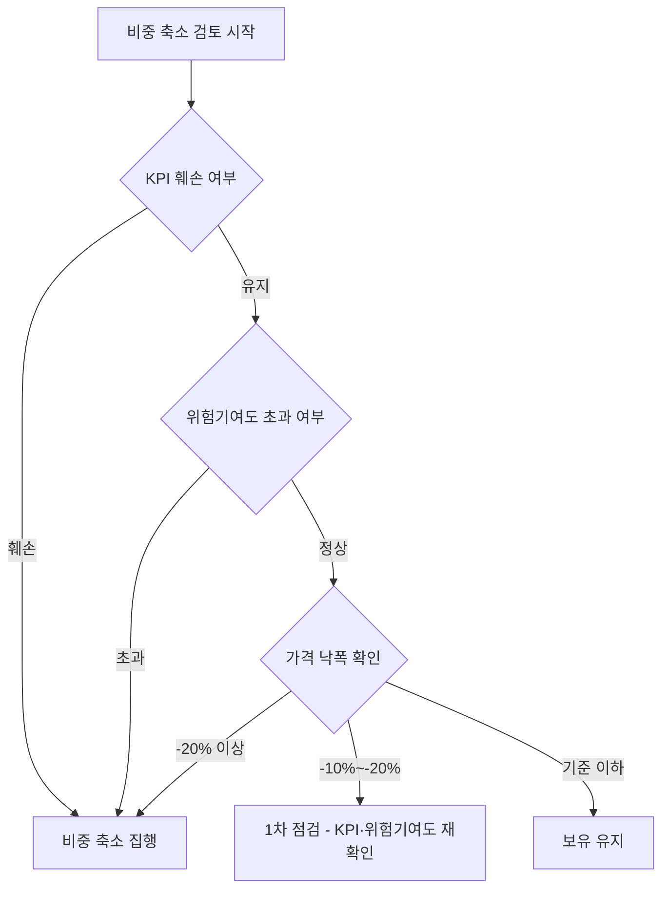

# 리스크 관리 전략

---

팀의 리스크 관리 전략은 추상적 원칙이 아니라 매일 숫자로 확인하고 판단하는 수치 기반 체계다. 포트폴리오 전체 리스크를 실시간으로 수치화하기 위해, 팀은 전용 대시보드를 제작 및 운용한다. 누적수익률·MDD·NAV 흐름·주요 매매 이벤트가 한 화면에 집약되어 있다. 이후 각 섹션의 리스크 원칙은 이 대시보드를 통해 매 거래일 점검하고 판단한다.

![[Pasted image 20260528202230.png]]

---

## 1. 리스크 지표와 초기 한도

**결론: 포트폴리오 리스크는 직관이 아니라 수치로 판단한다. 위험 노출은 사전에 정의된 한도와 비교할 때만 의미를 갖는다.**

단순 보유비중만으로 실제 위험 노출을 판단하지 않는다. 같은 비중이어도 변동성에 따라 포트폴리오에 대한 위험 기여는 크게 달라지기 때문이다. 이를 포착하기 위해 우리는 다섯 가지 지표를 지속적으로 확인한다.

이 지표들에 대해 우리는 사전에 정상 기준과 경고 기준을 정의한다. 연환산 변동성·목표비중 이탈폭·HHI 집중도는 펀드 운용 업계에서 광범위하게 활용되는 기준에 근거한다. 반면 MDD 한도와 단일 ETF 위험기여도 상한은 3개월이라는 운용 기간과 대회 특성을 반영한 팀 내 합의 기준이다.

| 구분           | 정상 기준   | 경고 기준   | 조치                            |
| ------------ | ------- | ------- | ----------------------------- |
| 연환산 변동성      | 25% 이하  | 30% 초과  | 고변동 ETF 비중 축소 검토              |
| HHI 집중도      | 0.18 이하 | 0.25 초과 | 특정 ETF/섹터 집중 완화               |
| 목표비중 이탈폭     | ±3%p 이내 | ±5%p 초과 | 리밸런싱 후보 지정                    |
| 단일 ETF 위험기여도 | 35% 이하  | 45% 초과  | 비중 축소 검토 (55% 초과 시 원칙적 일부 축소) |

이 수치 기준은 수익 기회를 포기하기 위함이 아니다. 한 번의 급락으로 회복 불가능한 상태에 빠지는 것을 막고, 3개월 운용 기간 전체에 걸쳐 성과와 운용 일관성을 함께 유지하기 위한 최소 안전망이다.

대시보드는 MDD·HHI·연환산 변동성을 정상/보통/경고 상태로 실시간 분류한다. 숫자를 개별로 해석하지 않아도 현재 리스크 수준을 즉시 파악할 수 있다.

![[Pasted image 20260528202330.png]]

---

## 2. 비중 관리 원칙

**결론: 분산은 종목 수가 아니라 위험의 출처로 판단한다. 서로 다른 ETF라도 같은 매크로 변수에 동시에 반응하면 분산 효과는 실질적으로 사라진다.**

단순히 여러 ETF를 담는 것만으로는 충분한 분산이 아니다. 반도체와 전력 인프라 ETF는 종목이 다르지만 AI CAPEX라는 같은 변수에 의해 함께 움직일 수 있다. 우리는 이런 위험의 동조화를 막기 위해 명목상 종목 수보다 실제 위험이 어디에서 발생하는지를 더 중요하게 판단한다.

### 자산군별 비중 한도

대회 규정 상 위험자산 편입 비중의 상한은 70%, 개별 ETF 비중 상한은 20%다. 대회 규정 준수 여부와 목표비중 이탈폭은 대시보드가 자동으로 감지한다. 규정 위반 항목과 리밸런싱 후보는 즉시 식별되며, 이것이 리밸런싱 논의의 출발점이 된다.

![[Pasted image 20260528203200.png]]

### 위험기여도 관리

단순 편입비중보다 위험기여도가 더 중요한 경우가 많다. 반도체나 방산처럼 변동성이 높은 ETF는 낮은 비중으로도 포트폴리오 전체 위험을 크게 키울 수 있다. 반대로 머니마켓이나 초단기채 ETF는 비중이 높아도 위험기여도가 낮아 방어 자산으로 기능한다. 우리는 단일 ETF 위험기여도가 35%를 넘으면 주의 대상으로, 45%를 넘으면 비중 축소를 검토하고, 55%를 넘으면 원칙적으로 일부를 축소한다.

예를 들어, 반도체 ETF를 목표비중 20%로 편입하더라도 변동성이 높은 국면에서는 포트폴리오 전체 위험기여도가 55%를 초과할 수 있다. 이 경우 대회 규정상 비중 기준은 충족하더라도 우리의 위험기여도 기준에 따라 비중 축소를 검토한다. 비중만 보는 것이 충분하지 않은 이유가 여기에 있다.

![[Pasted image 20260528202515.png]]

### 목표비중 이탈폭과 리밸런싱 후보 지정

각 ETF는 사전에 목표비중을 설정한다. 실제 비중이 목표비중에서 벗어나는 순간부터 포트폴리오는 처음에 설계한 위험 구조와 달라진다. 우리는 이탈폭이 ±3%p를 넘으면 관찰 대상으로 지정하고, ±5%p를 넘으면 리밸런싱 후보로 올린다. 다만 단순히 비중이 초과되었다고 즉시 매도하지 않는다. 투자 가설이 유지되고 위험기여도가 기준 이내라면 이탈 자체는 문제가 아닐 수 있다.

ETF별 세부 수치는 분석 테이블에서 확인한다. 현재비중·목표비중·이탈폭·개별 MDD·현재낙폭·20일 변동성·위험기여도가 한 줄에 집약되어, 어느 ETF가 어떤 기준에서 주의 대상인지 즉시 식별된다.

![[Pasted image 20260528202451.png]]

---

## 3. 분할매수·분할매도 원칙

**결론: 분산투자는 종목과 자산군에만 적용되는 원칙이 아니다. 우리는 시간도 분산의 대상으로 본다.**

한 번에 전량 매수하면 진입 시점의 오류가 전체 포트폴리오 손실로 바로 연결된다. 한 번에 전량 매도하면 일시적 변동성에 과잉 반응할 수 있다. 따라서 분할매수와 분할매도는 선택 사항이 아니라 기본 운용 원칙이다.

### 분할매수 원칙

신규 편입은 원칙적으로 2~3회 이상 나누어 진행한다. 1차에서 목표비중의 50%를 편입하고, 가격·KPI·시장 상황을 확인한 뒤 2차에서 25%를 추가하고, 최종 확인 후 나머지 25%를 편입하는 방식이다. 변동성이 큰 ETF는 최소 3영업일 이상에 걸쳐 분할 진입하며, 단기 급등 직후에는 전량 진입하지 않고 관찰 기간을 둔다.

### 분할매도 원칙

경고 신호가 발생했을 때도 원칙적으로 전량 매도하지 않는다. 1차 30% 축소 후 상황을 재점검하고, 악화가 지속되면 2차 30%, 투자 가설 훼손이 확정되면 나머지 40%를 축소하는 순서로 진행한다. 단, '손절 및 비중 축소 기준' 섹션의 즉각 조치 조건에 해당할 때는 분할 단계를 앞당겨 축소 속도를 높인다.

타이밍 판단의 보조 도구로 개별 ETF의 드로다운 히스토리를 활용한다. ETF를 선택하면 누적수익률·가격·드로다운 차트를 조회할 수 있다. 과거 낙폭 패턴을 확인함으로써 현재의 낙폭이 일시적 조정인지 구조적 하락인지 판단하는 맥락을 제공한다.

![[Pasted image 20260528202827.png]]

---

## 4. 손절 및 비중 축소 기준

**결론: 모든 ETF에 동일한 손절 기준을 적용하지 않는다. 비중 축소 여부는 가격 낙폭이 아니라 KPI 훼손, 위험기여도 초과, 가격 낙폭의 순서로 판단한다.**

가격 낙폭만 보고 기계적으로 손절하지 않는다. ETF마다 편입 이유, 변동성, 포트폴리오 내 역할이 다르기 때문이다. 반대로 가격이 유지되더라도 매수 근거가 무너졌다면 비중 축소를 검토한다.

### 판단 순서

비중 축소 여부는 다음 3단계 순서로 확인한다.

KPI는 자산군마다 다르게 정의된다. 섹터 ETF에서는 이익 모멘텀과 업황 지표, 채권에서는 금리 경로와 크레딧 스프레드, 원자재에서는 수급 균형과 지정학 변수가 KPI가 된다. 가격 낙폭은 검토의 출발점이지, 매도의 결론이 아니다. KPI가 유지되고 위험기여도가 정상 범위라면, -10% 낙폭은 보유를 유지하는 근거가 된다.

### 섹터 분류별 적용 원칙

투자철학의 섹터 해석 원칙에 따라 리스크 기준을 다르게 적용한다.

| 섹터 분류                     | 적용 원칙                                                   |
| ------------------------- | ------------------------------------------------------- |
| 펀더멘탈 전환 중 (반도체, 전력인프라)    | KPI 유지 중이면 낙폭 -10%는 분할매수 기회 검토. 가격 기준보다 KPI·섹터 이익 기준 우선 |
| 전환 시차가 큰 내러티브 (로봇 등)      | 내러티브 약화 신호에 민감하게 대응. 낙폭 기준을 더 엄격히 적용                    |
| 펀더멘탈이 훼손되는 내러티브 (일부 SaaS) | 가격 낙폭 기준 적용 불가. 구독 해지율·AI 대체 속도·FCF 악화가 주요 트리거          |
| 헤지·방어 자산 (금, 머니마켓)        | 편입 목적이 헤지이므로 단기 손실에도 보유 가능. 헤지 목적이 소멸할 때가 축소 시점         |

### KPI 기반 축소 기준 예시

| 자산/섹터   | 핵심 KPI                           | 축소 검토 기준                                         |
| ------- | -------------------------------- | ------------------------------------------------ |
| 반도체     | DRAM 가격, 엔비디아 실적·가이던스, 빅테크 CAPEX | DRAM 가격 반전, CAPEX 축소, 섹터 이익 모멘텀 둔화, 위험기여도 45% 초과 |
| 전력인프라   | 데이터센터 수주, 전력설비 CAPEX, 관련 기업 실적   | 수주 공백, CAPEX 둔화, AI CAPEX 연결고리 단절 신호, 20일 변동성 급등 |
| 방산      | 해외 수주, NATO 국방비, 지정학 리스크         | 지정학 긴장 완화 + 수주 지연 동시 발생                          |
| 소비재·내수  | 인바운드 관광객, 카드 사용액, 수출 잠정치         | MoM 2회 연속 둔화                                     |
| 원유      | 중동 공급, 호르무즈 해협, OPEC/비OPEC 증산    | 전쟁 종식 뉴스, 공급 재개, 급격한 유가 하락                       |
| 금       | 달러, 실질금리, 중앙은행 매입                | 달러 강세 + 실질금리 상승                                  |
| 채권/머니마켓 | 크레딧 스프레드, 금리 경로, 변동성             | 스프레드 재확대, 금리 인상 시그널                              |

---

## 5. 기준 보완 시스템

**결론: 지금 세운 기준이 영원히 맞을 필요는 없다. 운용 원칙은 고정된 규칙이 아니라 실행하면서 개선되는 체계다.**

우리는 하나의 원칙을 검증하는 것이 아니라 실제 운용을 성공시키는 것이 목표다. 기준이 맞지 않을 때 감으로 바꾸는 것이 아니라, 왜 맞지 않았는지를 기록하고 논의를 거쳐 수정하는 것이 이 시스템의 핵심이다.

### 포트폴리오 비교를 통한 기준 검증

기준 보완의 근거는 포트폴리오 비교 지표에서 도출한다. 대시보드는 현재 운용 포트폴리오와 여러 시나리오(aggressive·base·conservative 등)를 CAGR·MDD·샤프·칼마·소르티노 지표로 나란히 비교한다. 단순히 수익률이 높은 쪽이 아니라 위험 대비 성과가 어떤 구조를 가지는지를 비교함으로써, 현재 리스크 기준의 적정성을 객관적으로 점검한다.

![[Pasted image 20260528202943.png]]

위험-수익 분포 화면은 각 포트폴리오가 칼마-샤프 평면에서 어느 위치에 있는지를 한눈에 보여준다. 이 좌표 위에서 현재 운용의 위치를 파악하는 것이 기준 보완의 출발점이다.

![[Pasted image 20260528203051.png]]

### KPI 재정의 이벤트 처리

KPI 훼손과 KPI 재정의는 다르다. KPI 훼손은 현재 지배 변수가 예상과 반대 방향으로 움직이는 것으로, 비중 축소의 트리거가 된다. KPI 재정의는 시장이 집중하는 변수 자체가 바뀌는 것으로, 이 경우 단순히 비중을 줄이는 것이 아니라 포트폴리오 전체의 알파 판단을 처음부터 재검토해야 한다.

KPI 재정의 신호는 다음과 같이 감지한다. 첫째, 핵심 KPI가 움직여도 주가가 반응하지 않는 상태가 2~3주 이상 지속될 때. 둘째, 애널리스트 리포트에서 기존 핵심 지표 대신 새로운 변수를 강조하기 시작할 때. 셋째, 컨센서스 추정치의 전제가 이전과 다른 방향으로 재설정될 때. 이 신호가 포착되면 해당 섹터 포지션을 동결하고 팀 회의에서 새로운 지배 변수와 알파 판단을 재확인한다.

### 기준 변경 시 기록할 내용

기준을 변경할 때는 변경 전·후 기준, 변경 사유, 당시 시장 상황, 해당 결정이 투자철학과 어떻게 연결되는지, 다음 점검일을 반드시 운용로그에 기록한다. 기준 변경을 기록하지 않으면 운용 원칙이 감으로 흘러가는 것을 막을 수 없다.

### 예외 판단 원칙

숫자 기준은 판단을 시작하게 만드는 트리거이지 결론이 아니다. 최종 판단은 KPI 유지 여부와 KPI 재정의 신호 여부, 위험기여도, 포트폴리오 전체 MDD, 그리고 시장 충격이 일시적인지 구조적인지를 함께 고려해서 내린다. 숫자만 보고 기계적으로 매매하지 않는다.

---

## 최종 운용 원칙 요약

- 포트폴리오 리스크는 직관이 아니라 수치로 판단한다. 위험 노출은 사전에 정의된 한도와 비교할 때만 의미를 갖는다.
- 단순 보유비중보다 위험기여도가 더 중요하다. 비중이 낮아도 변동성이 높은 ETF는 포트폴리오 전체 위험의 대부분을 혼자 부담할 수 있다.
- 분산투자는 종목과 자산군에만 적용되는 원칙이 아니다. 시간을 나누어 진입하고 청산하는 분할매수·분할매도를 기본 원칙으로 삼는다.
- 비중 축소 판단의 순서는 KPI 훼손 → 위험기여도 초과 → 가격 낙폭이다. 가격만 보고 기계적으로 손절하지 않는다.
- KPI 훼손과 KPI 재정의를 구분한다. 지배 변수 자체가 바뀌는 신호가 포착되면 포지션을 동결하고 알파 판단을 처음부터 재검토한다.
- 리스크 관리는 손실이 난 뒤 대응하는 방식이 아니다. 포트폴리오 전체 위험을 사전에 수치화하고 조정하는 체계다.
- 리스크 기준은 고정된 규칙이 아니라 운용 과정에서 보완되는 체계다. 기준 변경과 예외적 판단은 반드시 운용로그에 기록한다.
