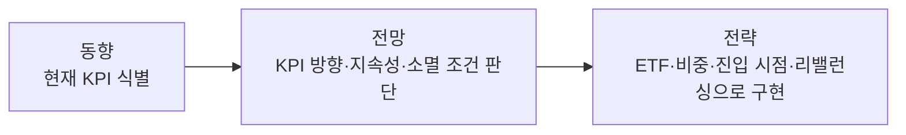

# 투자철학 v5

---

## 서문: 투자 판단의 출발점

경제와 시장은 단일한 공식으로 설명되지 않는다. 같은 산업, 같은 기업, 같은 ETF라도 어떤 시점에는 이익이 가격을 움직이고, 어떤 시점에는 금리, 수급, 정책, 내러티브, 원자재 가격, CAPEX, 환율이 가격을 움직인다.

그래서 우리의 첫 질문은 "좋은 자산인가"가 아니라 **지금 가격은 무엇에 반응하고 있는가**다. 투자 판단은 현재 가격을 움직이는 변수를 찾고, 그 변수가 앞으로 유지될지, 강화될지, 약화될지를 판단하는 데서 시작한다.

---

## 1. KPI: 가격을 움직이는 변수를 먼저 찾는다

**결론: KPI는 현재 가격에 영향을 주는 핵심 변수다. 과거의 KPI로 현재 시장을 판단하지 않는다.**

이 문서에서 KPI는 기업 성과지표(Key Performance Indicator)만을 뜻하는 것은 아니고, **현재 가격에 영향을 주는 핵심 변수**로 단순화했다. 이는 주식뿐 아니라 ETF, 채권, 원자재, 환율 등 모든 자산에 적용할 수 있는 투자 판단의 출발점이 된다.

투자 판단은 다음 3단계로 접근한다.

| 단계  | 핵심 질문                   | 역할                     |
| --- | ----------------------- | ---------------------- |
| 동향  | 지금 가격은 무엇이 움직이고 있는가?    | 현재 KPI 식별              |
| 전망  | 그 변수는 어떻게 바뀔 것인가?       | KPI 방향, 지속성, 소멸 가능성 판단 |
| 전략  | KPI가 움직일 때 어떻게 운용할 것인가? | 노출, 비중, 리스크 관리 원칙 정의   |

시장이 집중하는 변수는 고정되어 있지 않다. 같은 섹터라도 시기에 따라 가격을 움직이는 변수가 달라진다. 따라서 우리는 먼저 현재 시장이 무엇에 반응하고 있는지 확인해야 한다.

간단한 예시로는 반도체가 있다. 과거 반도체 사이클에서 지배 변수는 핸드셋이나 컴퓨터 등 메모리 수급, 가격 등이었다. 하지만 현재 AI 국면에서는 빅테크 CAPEX, 데이터센터 투자, HBM 수요가 가격을 움직이는 핵심 변수로 부상했다.

KPI 없이 하는 투자는 감에 의존하기 쉽다. 반대로 투자포인트의 근거로 KPI를 명시하면 왜 사고, 왜 보유하고, 왜 줄이는지를 설명할 수 있다.

---

## 2. 주가 = 펀더멘탈(EPS) × 센티먼트(PER)

**결론: 펀더멘탈로 방향을 정하고, 센티먼트로 타이밍과 비중을 조절한다.**

주식형 자산은 결국 PER × EPS의 곱으로 움직인다. 여기서 EPS는 펀더멘탈의 대표적인 표현방식이고, PER은 시장이 그 이익에 부여하는 기대와 할인율, 수급 등을 반영한다. 우리는 이를 더 직관적으로 **펀더멘탈은 방향, 센티먼트는 속도**라고 본다.

- 펀더멘탈은 가격이 어디로, 어디까지 갈 수 있는지를 결정한다.
- 센티먼트는 그 가격이 언제 반영되어, 얼마나 빠르게 움직일지를 결정한다.
- 장기 전략은 펀더멘탈 위에 세우되, 진입 타이밍과 비중 조절은 센티먼트를 함께 본다.

센티먼트는 시간이 지나면 두 가지 중 하나로 귀결된다. 하나는 실제 매출, EPS, FCF로 전환되며 펀더멘탈로 증명되는 경우다. 다른 하나는 기대만 만들었지만 숫자로 이어지지 못하고 노이즈로 소멸하는 경우다.

현재의 AI 패러다임을 이 관점에서 해석하면 핵심 질문은 다음과 같다.

> 빅테크의 대규모 CAPEX는 누구의 실적으로 먼저 연결되는가?

빅테크 입장에서는 CAPEX 부담과 수익화 시차가 존재한다. 하지만 하드웨어 공급망 입장에서는 CAPEX가 반도체, 전력 인프라, 장비, 산업재 수요에서 EPS로 더 빠르게 전환될 수 있다. 이 차이가 같은 AI 내러티브 안에서도 시장에 주목을 받는 시기와 주가 반응을 다르게 만든다.

중요한 것은 **펀더멘탈로 전환되는 기간**이다. 센티먼트가 숫자로 증명되기까지 시간이 길수록 주가는 금리, 유동성, 수급 변화에 더 크게 흔들린다. 로봇이나 우주, SMR처럼 미래 방향성은 매력적이지만 매출과 EPS 확인까지 시간이 필요한 테마는 중간 진폭이 커질 수 있다. 반면 반도체 ETF는 AI CAPEX가 발주, 가격, 매출, EPS로 이어지는 경로가 비교적 짧고 관찰 가능하기 때문에 같은 AI 내러티브 안에서도 변동의 성격이 다르다.

| 구분                   | 판단 기준                                 | 예시                                   |
| -------------------- | ------------------------------------- | ------------------------------------ |
| 숫자 전환이 빠른 내러티브       | 매출, EPS, FCF로 이어지는 경로가 비교적 짧고 확인 가능한가 | 반도체, 전력 인프라, 일부 장비                   |
| 숫자 전환까지 시간이 긴 내러티브   | 장기 방향은 유효하지만 실적 확인까지 시간이 필요한가         | 로봇, 일부 AI 응용 서비스(OpenAI 등), 우주·방위산업 |

따라서 좋은 방향인지만 보는 것은 충분하지 않다. 우리는 그 방향성이 **얼마나 빠르게 숫자로 전환되는지**, 그리고 그 숫자가 실제 현금흐름으로 이어지는지를 함께 확인한다. 특히 이번처럼 제한된 운용 기간에서는 방향성 자체보다 센티먼트가 포트폴리오 성과에 더 직접적인 영향을 줄 수 있다.

---

## 3. 포트폴리오 운용원칙과 리스크관리

**결론: 좋은 리서치와 좋은 운용은 다르다. 무엇이 좋아 보이는지 판단하는 것과, 그것을 포트폴리오에 어떻게 담고 관리할지는 별개의 문제다.**

어떤 섹터나 ETF가 좋아 보인다는 판단만으로 운용이 완성되지는 않는다. 같은 투자 아이디어라도 어떤 ETF를 선택하는지, 어느 정도 비중으로 담는지, 언제 진입하고 언제 조정하는지에 따라 결과는 달라진다.

### 3.1 선택과 운용의 분리

투자 판단은 펀더멘탈과 센티먼트로 결정된다. 집행은 그 판단을 감내 가능한 위험 범위 안에서 ETF, 비중, 진입 시점, 리밸런싱으로 구현하는 과정이다. 둘을 구분해야 좋은 아이디어가 과도한 비중, 잘못된 진입 시점, 불필요한 리스크로 훼손되는 것을 막을 수 있다.

- **선택의 핵심**: 현재 가격을 움직이는 핵심 변수가 무엇인지(동향), 그 변수가 앞으로 강화될지 약화될지(전망)
- **운용의 핵심**: 그 판단을 감내 가능한 위험 범위 안에서 구체적 전략으로 구현(전략)

### 3.2 포트폴리오 구현과 리스크 관리 철학

운용은 초기 포트폴리오 구성 전략을 지속적으로 유지하는 것이 아니라 유연하게 변화시켜야 한다. 시장은 복잡계이고, KPI의 방향도 시간이 지나며 바뀔 수 있다. 따라서 보유 중에는 KPI 유지 여부와 포트폴리오 균형을 함께 점검한다.

포트폴리오 구현과 리밸런싱의 핵심 질문은 다음과 같다.

| 질문                                    | 의미          |
| ------------------------------------- | ----------- |
| 처음 매수한 투자포인트와 이를 뒷받침하는 KPI가 유지되고 있는가? | 투자 가설 점검    |
| ETF의 변동성과 위험기여도가 과도하지 않은가?            | 포트폴리오 위험 점검 |
| 동일한 노출을 더 효율적으로 구현할 ETF가 있는가?         | ETF 선택 점검   |
| 차트와 수급은 진입 타이밍에 유리한가?                 | 보조 판단       |

리스크 관리의 핵심은 **지금의 손실이 일시적 변동성인지, 아니면 투자 가설 자체가 훼손된 것인지 구분하는 것**이다. 구분 기준은 단순하다. 매수 당시 투자포인트를 뒷받침하는 KPI가 약화되거나 소멸했다면 가설 훼손, 유지되되 가격만 흔들렸다면 일시적 변동성이다.

우리의 리스크 관리는 단순히 손실이 난 뒤 대응하는 방식이 아니다. 포트폴리오가 감내 가능한 위험 범위 안에 있는지 사전에 점검하고 조정하는 체계다.

시장 자체의 변동성이 큰 구간에서는 섹터 선택보다 포트폴리오의 베타 관리가 먼저다. 이 시기에는 자산 간 상관관계가 높아지고, 섹터 선택의 변별력이 약해질 수 있다. 특정 ETF의 투자 논리가 유효하더라도 포트폴리오 전체 위험기여도가 과도하면 비중을 줄일 수 있다. 반대로 단기 손실이 발생하더라도 매수 근거가 유지되고 전체 위험 범위 안에 있다면 기계적으로 손절하지 않는다.

---

## 최종 원칙 요약

- 모든 투자 판단은 현재 가격이 무엇에 반응하는지 확인하는 데서 시작한다.
- KPI는 현재 가격에 영향을 주는 핵심 변수다. 기업 성과지표가 아니다.
- 주식형 자산은 펀더멘탈과 센티먼트의 곱으로 해석한다.
- 펀더멘탈은 경기·정책·산업으로 구성되며, 숫자로 관찰·추적할 수 있다.
- 센티먼트는 시장심리·내러티브·수급으로 드러나며, 신념이 강할수록 오래 지속된다.
- 펀더멘탈은 방향을, 센티먼트는 속도와 진폭을 결정한다.
- 주가의 선행성은 정상적인 가격 발견 메커니즘이다. 센티먼트는 그 선행 폭이 기대를 추가로 초과할 때 작동한다.
- 가격(차트)과 수급은 센티먼트의 강도와 온도를 읽는 도구다.
- 센티먼트는 시간이 지나며 숫자로 증명되거나 노이즈로 소멸한다.
- 펀더멘탈 전환 기간이 길수록 금리, 유동성, 수급 변화에 더 크게 흔들린다.
- 좋은 판단과 좋은 운용은 다르다.
- 포트폴리오 운용은 투자 판단을 감내 가능한 위험 범위 안에서 구현하는 과정이다.
- 리스크 관리는 손실률 자체보다 투자 가설 훼손 여부와 포트폴리오 위험기여도를 구분하는 일이다.
- 매수 근거인 KPI가 유지되고 전체 위험 범위 안에 있다면 단기 낙폭만으로 매도하지 않는다.
- 반대로 KPI가 훼손되거나 포트폴리오 위험기여도가 과도해지면 비중 축소를 검토한다.
- 리포트, 차트, 수급은 결론이 아니라 가정과 시장 반응을 점검하는 도구다.
