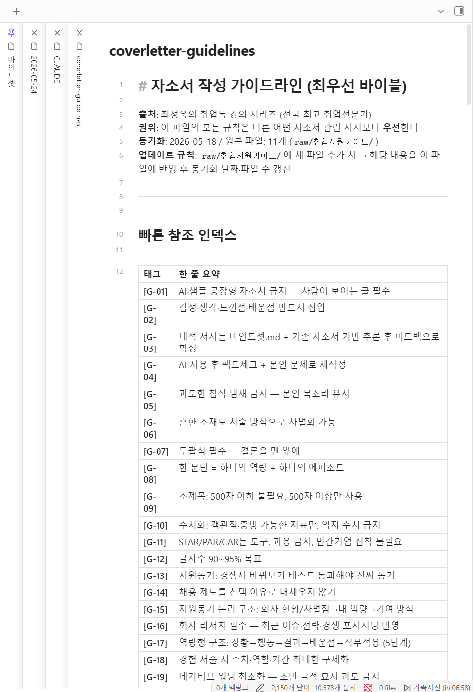

# DBGAPS 포트폴리오 월간보고서 2026년 05월

## 성과 요약
- CAGR: 18.54%
- 누적수익률: +107.73%
- MDD: -13.08%
- 샤프: 1.62
- 칼마: 1.42
- 연간변동성: 10.87%
- 승률: 56.79%
- Alpha: +7.01%
- Beta: 0.33

## 당월 수익률
- 2026-05 +9.30%

## 주간별 수익률 테이블
| 기간 | 수익률 |
|---|---:|
| 2026-05-04 ~ 2026-05-08 | +6.04% |
| 2026-05-11 ~ 2026-05-15 | +0.93% |
| 2026-05-18 ~ 2026-05-22 | +2.13% |

## 리스크 규칙 체크
- 개별 ETF 상한: failed (2개 위반)
  - KODEX 200: 비중 43.57%, 한도 20.00%, 초과 23.57%
  - TIGER 미국S&P500: 비중 27.49%, 한도 20.00%, 초과 7.49%
- 위험자산 상한: failed (비중 81.78%, 한도 70.00%, 초과 11.78%)

## 회전율
- 초기: 97.15% (거래금액 97,150,000, 한도 80.00%, failed)
- 주간: 2026-01-12 3.41% (거래금액 3,407,500, 한도 10.00%, passed)
- 월간: 2026-01-31 100.56% (거래금액 100,557,500, 한도 10.00%, failed)

## 보유현황
| 종목명 | 비중 | 수익률 |
|---|---:|---:|
| KODEX 200 | 43.57% | +310.38% |
| ACE KRX금현물 | 10.71% | +102.17% |
| TIGER 미국S&P500 | 27.49% | +56.11% |
| KOSEF 국고채10년 | 18.22% | -4.74% |

## 이미지 렌더링 테스트

